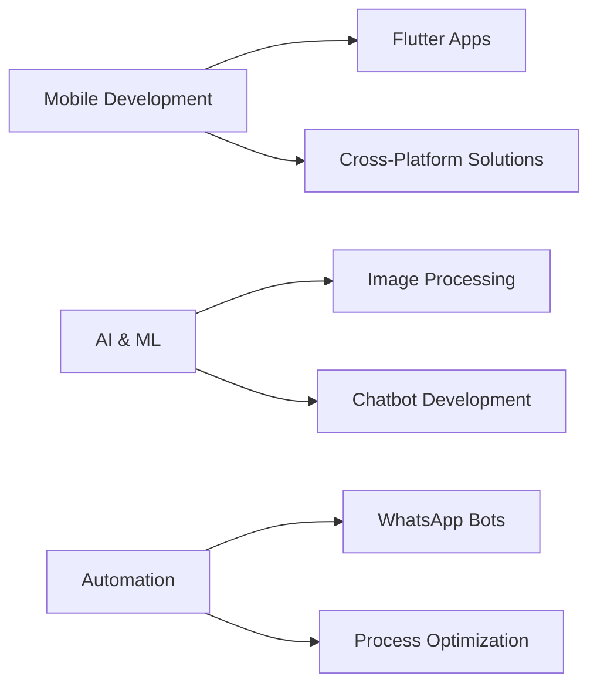

# Hi there! 👋 I'm Kashee Keswani

<div align="center">
  


[](https://github.com/kasheekeswani)
[](https://github.com/kasheekeswani)
[](https://github.com/kasheekeswani)

</div>

## 🌟 About Me

```python
class Developer:
    def __init__(self):
        self.name = "Kashee Keswani"
        self.role = "Full Stack Developer"
        self.languages = ["Python", "JavaScript", "Dart", "Java"]
        self.frameworks = ["Flutter", "React", "Node.js", "Flask"]
        self.specialties = ["Mobile Development", "Image Processing", "Automation"]
        self.current_focus = "Building innovative mobile and web applications"
    
    def say_hi(self):
        print("Thanks for dropping by! Let's build something amazing together 🚀")

me = Developer()
me.say_hi()
```

## 🛠️ Tech Stack & Tools

<div align="center">

### 💻 Languages


### 🚀 Frameworks & Libraries


### 🛠️ Tools & Technologies


</div>

## 🔥 Featured Projects

<div align="center">

| 🎯 Project | 📝 Description | 🛠️ Tech Stack | ⭐ Stars |
|------------|----------------|----------------|----------|
| **[EagleEye](https://github.com/kasheekeswani/EagleEye)** | Adaptive edge-preserving filter for low-light image enhancement |  |  |
| **[WhatsApp Birthday Bot](https://github.com/kasheekeswani/whatsapp_birthdaybot)** | Automated birthday reminder system |  |  |
| **[ChatBot](https://github.com/kasheekeswani/chatbot)** | Intelligent conversational AI system |  |  |
| **[WebView Flutter iOS](https://github.com/kasheekeswani/webview_flutter_ios)** | iOS WebView implementation for Flutter |  |  |

</div>

## 📊 GitHub Analytics

<div align="center">
  


</div>

## 🏆 GitHub Trophies

<div align="center">


</div>

## 🎯 Current Focus



## 🌐 Connect With Me

<div align="center">

[](https://linkedin.com/in/kasheekeswani)
[](https://twitter.com/kasheekeswani)
[](https://instagram.com/kasheekeswani)
[](mailto:your.email@gmail.com)

</div>

## 💡 Random Dev Quote

<div align="center">


</div>

## 🐍 Contribution Graph

<div align="center">


</div>

---

<div align="center">
  
### 💖 Thanks for visiting my profile! 


**Happy Coding!** 🚀✨

</div>
