```mermaid
%%{init: {'theme':'dark', 'themeVariables': { 'primaryColor': '#FF6B6B', 'primaryTextColor': '#ffffff', 'primaryBorderColor': '#FF6B6B', 'lineColor': '#FF6B6B'}}}%%
graph LR
    A[🎯 MERN Stack] --> B[🚀 Full Stack Apps]
    C[📱 React Native] --> D[📲 Cross Platform Mobile]
    E[🎨 Flutter] --> F[💙 Beautiful UIs]
    G[🤖 Python] --> H[🧠 AI/ML Solutions]
    I[☁️ Cloud] --> J[🌐 Scalable Deployment]
```

# <div align="center">👋 Hello, I'm **Kashee Keswani**</div>

<div align="center">
  
[](https://git.io/typing-svg)


[](https://github.com/kasheekeswani)
[](https://github.com/kasheekeswani?tab=followers)
[](https://github.com/kasheekeswani)

</div>

<br>

##  About Me


```javascript
const kashee = {
    name: "Kashee Keswani",
    role: "Full Stack Developer",
    location: "India 🇮🇳",
    
    techStack: {
        frontend: ["React", "React Native", "Flutter", "Next.js"],
        backend: ["Node.js", "Express.js", "Python", "Flask"],
        database: ["MongoDB", "Firebase", "MySQL"],
        mobile: ["React Native", "Flutter"],
        tools: ["Git", "Docker", "VS Code", "Postman"]
    },
    
    currentlyLearning: ["TypeScript", "AWS", "GraphQL"],
    hobbies: ["Coding", "Problem Solving", "Tech Innovation"],
    
    getAmbition: () => "Building scalable applications that impact millions! 🚀"
};
```

<br><br>

##  Tech Arsenal

<div align="center">

### Frontend Mastery


### Backend & Database


### Mobile Development


### DevOps & Tools


</div>

<br>

##  Featured Projects

<div align="center">

<table>
<tr>
<td width="50%">

### 🦅 EagleEye
**Advanced Image Processing System**
- Adaptive edge-preserving filter for low-light enhancement
- Python-based computer vision solution
- Real-time image optimization algorithms

`Python` `OpenCV` `Image Processing`

[](https://github.com/kasheekeswani/EagleEye)

</td>
<td width="50%">

### 🤖 WhatsApp Birthday Bot
**Intelligent Automation System**
- Automated birthday reminder notifications
- WhatsApp integration with smart scheduling
- Contact management and personalization

`Python` `Automation` `WhatsApp API`

[](https://github.com/kasheekeswani/whatsapp_birthdaybot)

</td>
</tr>
<tr>
<td width="50%">

### 💬 AI ChatBot
**Conversational Intelligence**
- Natural language processing capabilities
- Context-aware response generation
- Machine learning integration

`Python` `NLP` `Machine Learning`

[](https://github.com/kasheekeswani/chatbot)

</td>
<td width="50%">

### 📱 Flutter WebView iOS
**Cross-Platform Solution**
- Native iOS WebView implementation
- Flutter plugin development
- Seamless web-to-mobile integration

`Flutter` `Dart` `iOS` `WebView`

[](https://github.com/kasheekeswani/webview_flutter_ios)

</td>
</tr>
</table>

</div>

<br>

##  GitHub Analytics

<div align="center">


</div>

<br>

##  Achievements & Trophies

<div align="center">

[](https://github.com/ryo-ma/github-profile-trophy)

</div>

<br>

##  Current Journey

<div align="center">



</div>

<br>

##  Let's Connect!

<div align="center">

[](https://linkedin.com/in/kasheekeswani)
[](https://twitter.com/kasheekeswani)
[](https://instagram.com/kasheekeswani)
[](mailto:your.email@gmail.com)
[](https://your-portfolio.com)

</div>

<br>

##  Fun Facts

<div align="center">

📊 **This Week I Spent My Time On:**
<!--START_SECTION:waka-->
```text
JavaScript   8 hrs 15 mins   ████████████░░░░░░░░░░░░░   48.30%
Python       4 hrs 20 mins   ██████░░░░░░░░░░░░░░░░░░░   25.44%
Dart         2 hrs 45 mins   ████░░░░░░░░░░░░░░░░░░░░░   16.12%
TypeScript   1 hr 45 mins    ██░░░░░░░░░░░░░░░░░░░░░░░   10.14%
```
<!--END_SECTION:waka-->


</div>

<br>

<div align="center">
  


### 💫 *"Code is like humor. When you have to explain it, it's bad."* 

**⭐ Star my repositories if you find them interesting!**


**Happy Coding! 🚀✨**

</div>
